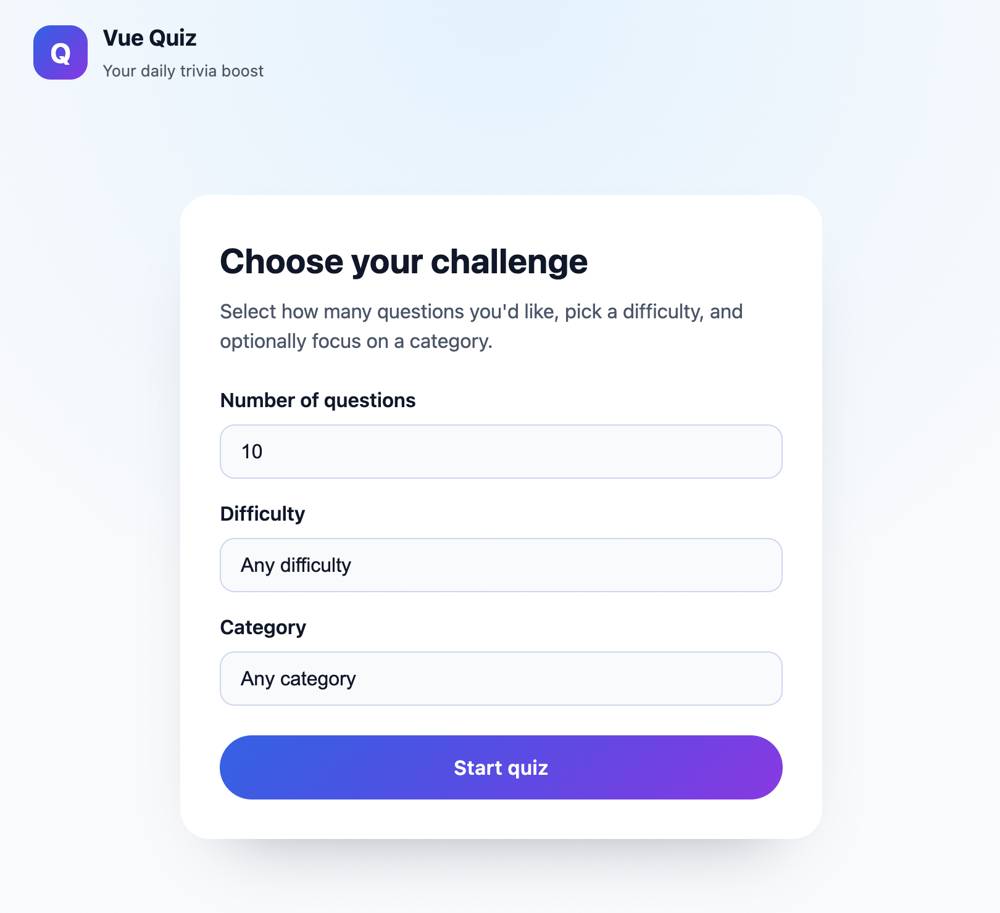
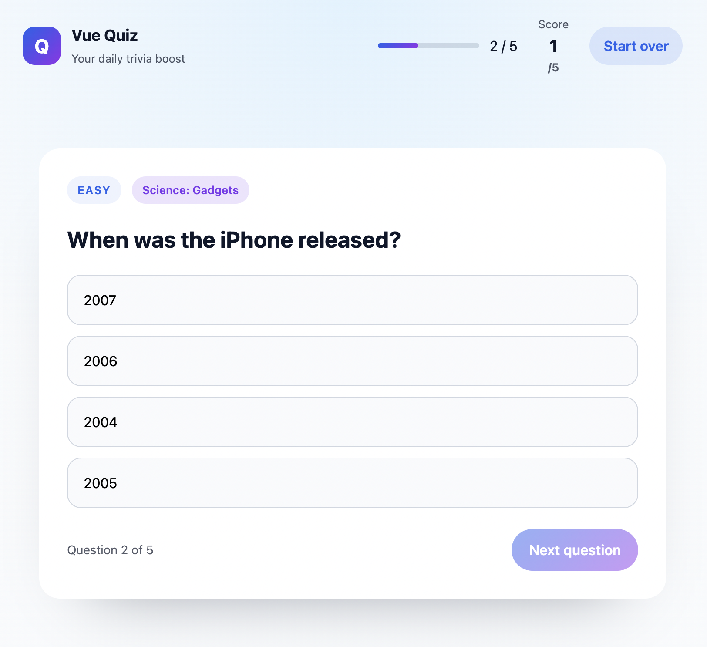

# Vue Quiz

A refreshed trivia experience built with Vue 3 and Vite. Pick how many questions you'd like, tailor the difficulty or category, and challenge yourself with curated questions from the Open Trivia DB API.




## Getting started

```bash
npm install
npm run dev
```

Then open the printed URL (default http://localhost:5173) to play the quiz.

## Scripts

```bash
npm run dev     # start Vite dev server with hot module replacement
npm run build   # create a production build in ./dist
npm run preview # preview the production build locally
npm run lint    # run ESLint against .vue and .js files
```

## Highlights

- Modern Vue 3 single-file components powered by Vite
- Guided setup screen with category and difficulty filters
- Loading and error states with retry support
- Responsive design with updated visuals, progress indicator, and score tracking
- Summary screen with accuracy stats and quick replay options

Questions are sourced from [Open Trivia Database](https://opentdb.com/).
